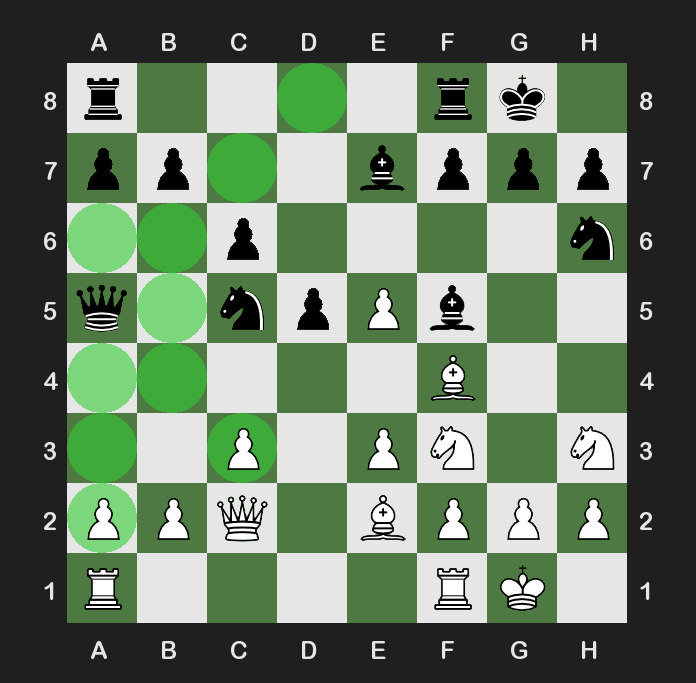
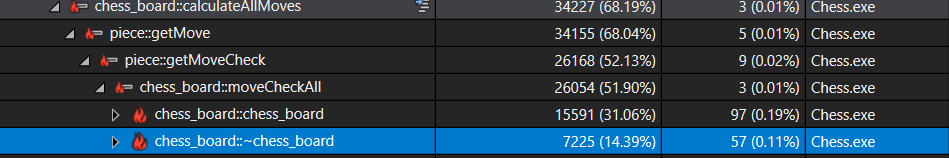

# Chess
A chess engine in C++ utilizing the SFML library for it's GUI.

## Dependencies
- Require SFML system, window, graphic, audio and network libraries to run.

## Features
- Can play locally with another player, against my AI or host a game online.
- En Passe, castling, promotion, stalemates, checks and checkmates are handled by engine.
- Displays valid moves on GUI, allowing newer players identify moves they can perform.
- Utilizes a MiniMax algorithm with Alpha Beta pruning to identify the best move. Evaluation function uses a heuristic based on position and values of piece if it captures one. The tables and values are from: https://www.chessprogramming.org/Simplified_Evaluation_Function

## Challenges
- At first, the engine was designed to evaluate moves lazily. This meant when the user chooses a move, the engine will verify if that move is valid after it is selected. This ultimately led to complications in features such as checkmate and the AI. For checkmate this system did not work as there are no moves to choose, thus checkmate is never achieved. For the AI, lazy evaluation could work but would result in inefficiencies. This made me redesign the engine to calculate all the moves for each turn, and then the evaluation would just be the player choosing out of these legal moves.

## Future considerations
- When I first started this project I wanted to design the engine using an array of objects, as that is what seemed to be the most logical to me at the time. I did not investigate the state of the art of chess engines and how they are designed, and this bottlenecked my AI in terms of performance. While there are possible improvements to performance of the AI, the engine is not properly fitted to allow efficient generation and search of moves for depths of greater than 3 in a reasonable amount of time. Throughout various tests, the AI evaluates 100 positions per second, which is very slow compared to the search space, for instance at depth 8 you have to evalaute up to 5 million positions with Alpha Beta pruning!

- In particular, my engine does not support make and unmake funcitons to try and revert moves, and thus it has to use copies of a board for each tested move signifigantly reducing performance, especially when coupled with the fact that the board stores objects resulting in even greater slowdown. In the profiling picture below, the object creation and deletion is the main cause of slowdown in the AI function. I would recommend reading upon engine design if you are considering making an engine of your own. In the future I will redesign the engine to utilize bitboards to hold the states of the board, which allow quick evaluation of the position utilizing bitwise arithmetic and continue development on the AI.

